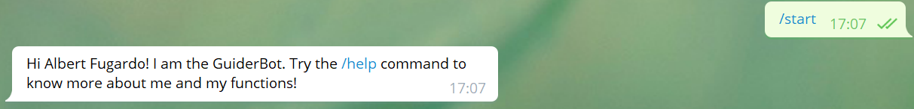
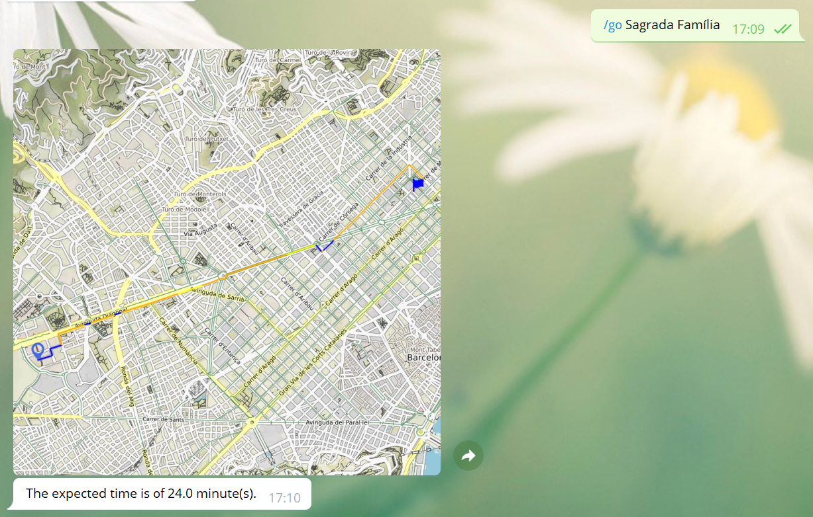
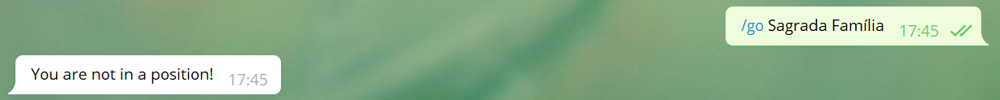

# GuiderBot
Do you want to go from one place to another in Barcelona with the speed of the light? Now it's possible. We present you the GuiderBot. Through Telegram, this bot returns the shortest path from one place to another and much more!

## Description
The objective of this project was to create a program that was able to calculate the shortest path from one point to another in the city of Barcelona, taking into account the real time congestions on it. Then, to test it, a bot has been created, with some interactive functions. For example, you can see your current position or plot the map that shows the shortest path from one place to another.<br />
This project consists of two files.

The body of the project is the igo.py file. It contains all the code related to creating the graph, adding attributes to it(such as congestions, highways and itime) and calculating the shortest path from one node to another. This path is obtained taking into account the itime, the time necessary to go from the start to the end of a street(edges in the graph), calculated with the length of the street, the maximum speed, and the real time congestions.

The bot.py file uses the igo.py file. It shows to the world all the operations that are done in the igo.py file. It has different functions, such as /start, /help, /author, /go, /where, /set and /myplaces.<br />
The behaviour of every function is explained on the same bot, and it can be seen sending a message with the /help command to the bot.

**Background**: To see a more complete description of the project, please visit this [link](https://github.com/jordi-petit/ap2-igo-2021).

## Installation
All the extensions required to run the project are in the requirements.txt document.

## Usage
As stated before, we can interact with the bot using telegram. First of all, telegram has to be installed and set. To do so, visit this [link](https://xn--llions-yua.jutge.org/python/telegram.html) and follow the **requirements** section.

After doing this, a line of code of the bot.py document has to be modified.
Your bot's token has to be pasted in the following line, to be able to execute the programs.
```
TOKEN = #paste your token here
```
When this is done, the bot is very simple to use. If /start is executed, the bot sends a message to the user introducing him to the objective of the bot and its different actions. Then, there is the /help command, which explains all the different bot's commands and their usage. Try to exectue the bot and use the /help command to see all the other functions and their working. <br />
The bot's responses look like that:
- The start function works this way:

- The /go function is the main function in the bot. It returns an image with the shortest path to go from one point to another(colored by the congestion in every tram) and the expected time to reach the destination. The map and the message look like this:

But be careful, because there can be some errors if the actions are not done properly.<br />
For example, if you use /go without a current position, the bot will return the following:

But don't worry. All the possible errors are considered, and if one appears, the bot will return a message with an explanation of the error and how to solve it. Now it's up to you to try to find all the possible errors and exceptions!

## Authors and acknowledgment
- Authors: Mauro Filomeno and Albert Fugardo
- Teachers: Jordi Petit and Jordi Cortadella
- Subject: Algorísmia i Programació 2
- Degree: Grau en Ciència i Enginyeria de Dades, Universitat Politècnica de Catalunya

## Support
If for any reason help is necessary, contact:
- mauro.filomeno@estudiantat.upc.edu
- albert.fugardo@estudiantat.upc.edu

## License
